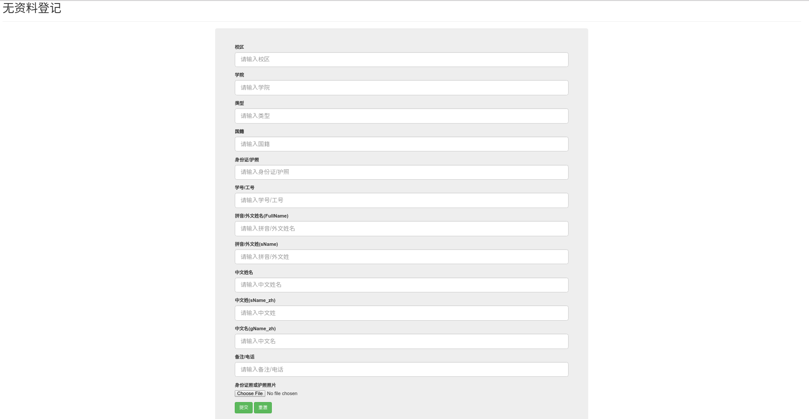
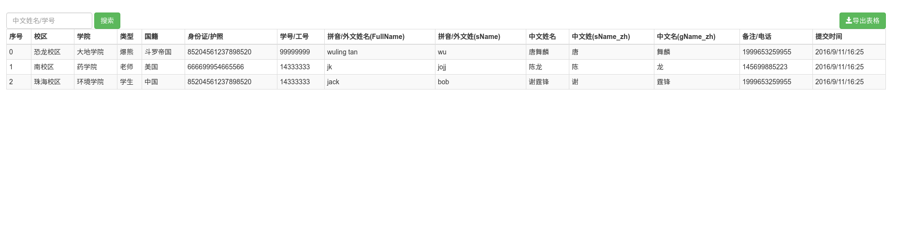
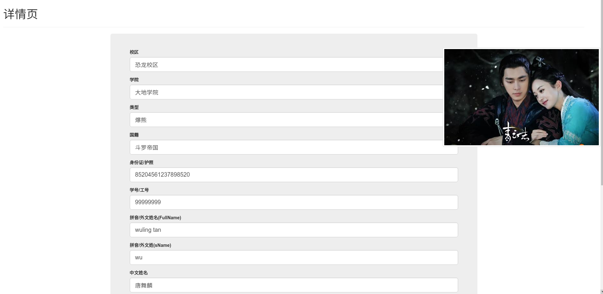

# 基于nodejs+mongodb的资料上传系统
### 介绍
1. 项目介绍：采用nodejs作为服务端语言，mongodb作为数据库，ejs作为模板渲染引擎，bootsctrap作为前端样式框架
2. 功能介绍：提交资料，资料的增、删、查、改，以表格的形式导出资料并进行下载和搜索等功能
3. 这是我为学习nodejs而做的一个小型练习，功能尚不完善、bug还存在，登陆登出功能尚未实现。该项目其实可以算作是我的另一个迷你项目《多文件上传与下载》的升级版吧。
### 项目运行
1. 需先安装nodejs和mongodb
2. 在项目的跟目录下，运行npm install安装需要的依赖模块。安装完后先启动mongo，然后运行node bin/www，在浏览器中输入lcoalhost:3000即可进入应用
### 技术实现
1. 对于前端提交的文字资料，服务端是将之保存在mongodb中的，而一些图片资料则是直接保存在本地的一个文件夹中的
2. 服务端的话，则主要初步学习了mongodb的使用
### 效果预览
1. 资料提交界面
 
2. 主页
 
3. 列表页

注：左上角的搜索功能和右上角的导出功能均已经初步实现
4. 详情页
 
注：详情页中右边的图片，是记有对应资料。在该页中，我们能核对填写的资料是否与图片中的资料是否一致，若不一致 则可以进行修改并保存